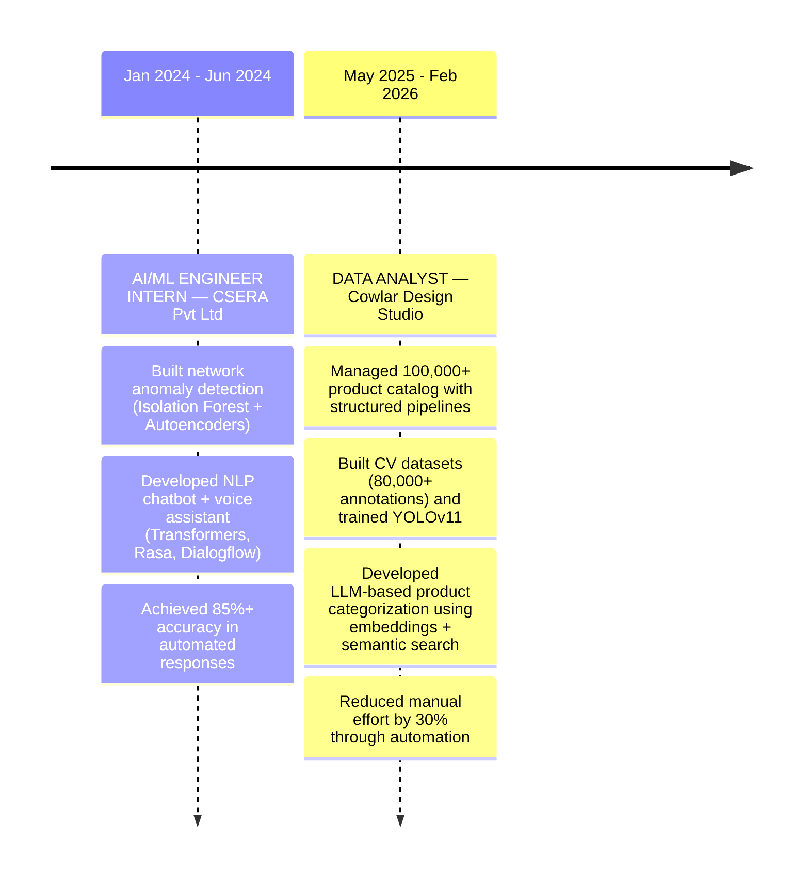
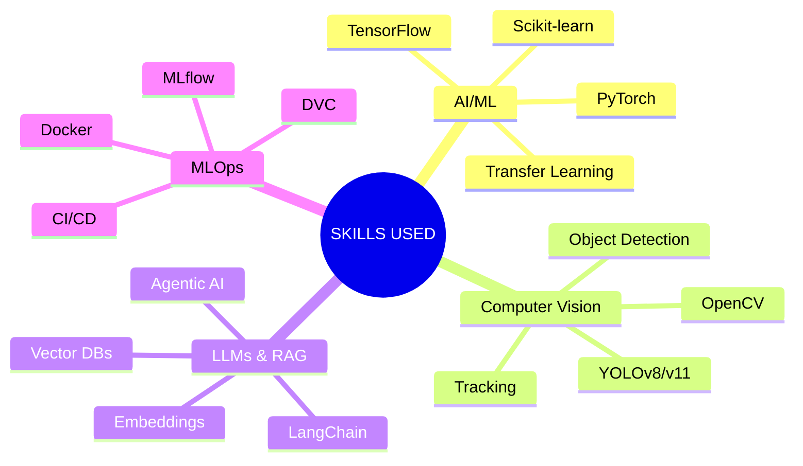

<div align="center">


<a href="https://git.io/typing-svg">
  
</a>

<br/><br/>

<p>
  
  
  
</p>

<p>
  <a href="mailto:munimakbar113@gmail.com">
    
  </a>
  <a href="https://www.linkedin.com/in/munim-akbar/">
    
  </a>
  <a href="https://www.kaggle.com/munimakbar">
    
  </a>
</p>

</div>

<br/>

---

## `whoami`

```python
class MunimAkbar:
    def __init__(self):
        self.role = "AI/ML Engineer & Data Analyst"
        self.location = "Islamabad, PK"
        self.focus_areas = [
            "Computer Vision 👁️",
            "Data Analytics 📊",
            "LLMs & Agentic AI 🤖",
            "MLOps ⚙️"
        ]
        self.expertise = {
            "pipeline": "data → training → deployment → monitoring",
            "infrastructure": ["Docker", "MLflow", "DVC", "CI/CD"],
            "frameworks": ["LangChain", "YOLOv8/v11", "PyTorch", "TensorFlow"]
        }

    def current_focus(self):
        return {
            "building": "AI-powered intelligent systems",
            "learning": "Advanced agentic AI, CrewAI & production deployment",
            "open_to": "AI/ML & Data Analytics opportunities — Remote | On-site"
        }
```

---

## 🚀 Featured Projects

<table>
<tr>
<td width="50%" valign="top">

### 📞 AI Voice Receptionist — Sara
`LiveKit Agents` `n8n MCP` `Google Calendar` `Deepgram` `GPT-4o`

Inbound AI voice receptionist that answers phone calls and handles appointment scheduling end-to-end — books, looks up, reschedules, and cancels appointments entirely via voice. STT (Deepgram Nova-3) → LLM (GPT-4o) → TTS (Cartesia Sonic-3) pipeline on LiveKit Cloud, wired to an n8n MCP server for Google Calendar + Sheets tool calls, deployed on Railway.

</td>
<td width="50%" valign="top">

### ⚽ AI-Powered Football Match Analysis *(FYP)*
`YOLOv8` `Siglip` `UMAP` `OpenCV` `FastAPI`

Player, ball, and referee detection with team classification (Siglip + UMAP + KMeans) and tactical visualizations — radar view, Voronoi diagrams, trajectory tracking. **~86% accuracy**, real-time deployment.

</td>
</tr>
<tr>
<td width="50%" valign="top">

### 🧠 Kidney Disease Classification
`VGG16` `DVC` `MLflow` `Docker` `FastAPI`

End-to-end MLOps pipeline with OOD detection via cosine similarity, DVC + MLflow + DagsHub experiment tracking, Dockerized deployment, and a Hugging Face Spaces UI. **92% accuracy**.

</td>
<td width="50%" valign="top">

### 🫁 Pneumonia Detection with Vision Transformers
`ViT` `ResNet` `Gradio` `MongoDB` `GitHub Actions`

Dual-model system: ResNet for OOD detection + ViT for classification, wrapped in a CI/CD pipeline (GitHub Actions + DVC + MLflow) with a Gradio app and MongoDB integration. **94% accuracy**.

</td>
</tr>
</table>

---
<br/>

## 🗂️ WORK // FIELD OPERATIONS

<div align="center">

# FIELD DOSSIER // CAREER LOG

</div>

<br>



<br>

---



---

## 🌱 Current Focus

| Area | Details |
|:--|:--|
| ⚽ **Sports & CV Analytics** | Object detection, tracking, tactical visualizations |
| 🤖 **Agentic AI** | CrewAI, tool use, multi-step planning |
| 🏭 **LLMs & RAG** | Embeddings, semantic search, vector databases |
| ⚙️ **MLOps** | End-to-end pipelines, experiment tracking, deployment |

---

## 🛠️ Tech Arsenal

<div align="center">

**Core ML & AI**<br/>

&nbsp;


<br/><br/>**LLMs & Agentic AI**<br/>


<br/><br/>**MLOps & Deployment**<br/>

&nbsp;


<br/><br/>**Data, Cloud & Tools**<br/>

&nbsp;


</div>

---

## 📊 GitHub Analytics

<div align="center">


</div>

---

## 🎓 Education

**BS Artificial Intelligence** — Air University, Islamabad *(2021 – 2025)*

---

## 💬 Let's Connect

<div align="center">

<a href="mailto:munimakbar113@gmail.com"></a>
<a href="https://www.linkedin.com/in/munim-akbar/"></a>
<a href="https://www.kaggle.com/munimakbar"></a>
<a href="https://github.com/munimakbar"></a>

<br/><br/>

*⭐ Open to AI/ML & Data Analytics opportunities — Remote | On-site*

<br/>


</div>
